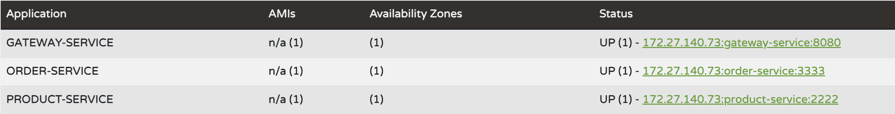
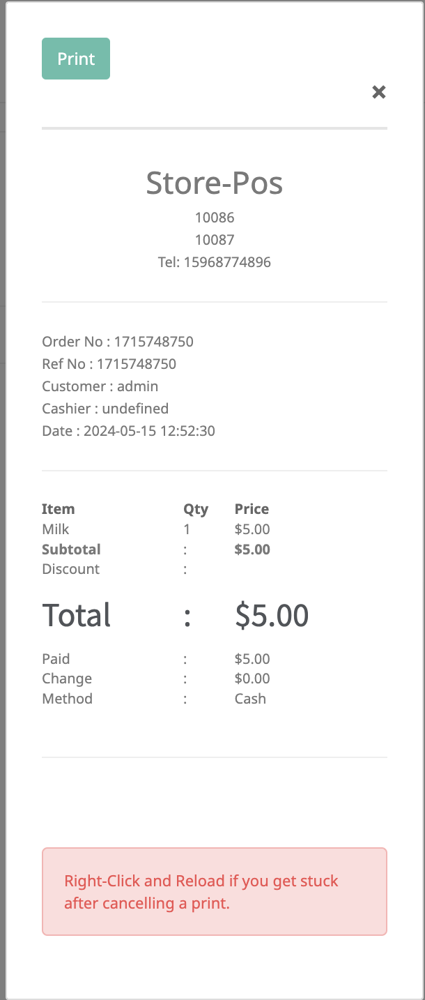
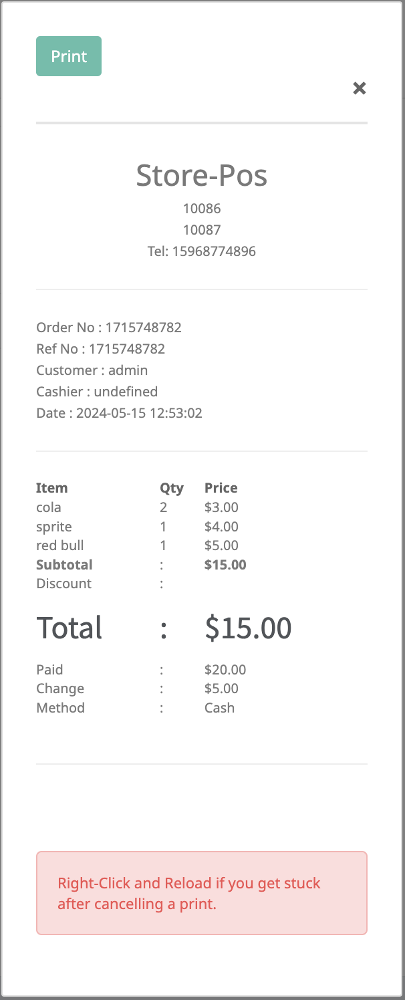
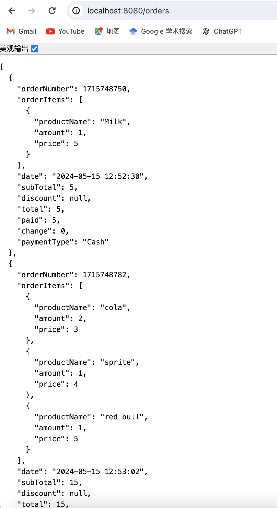
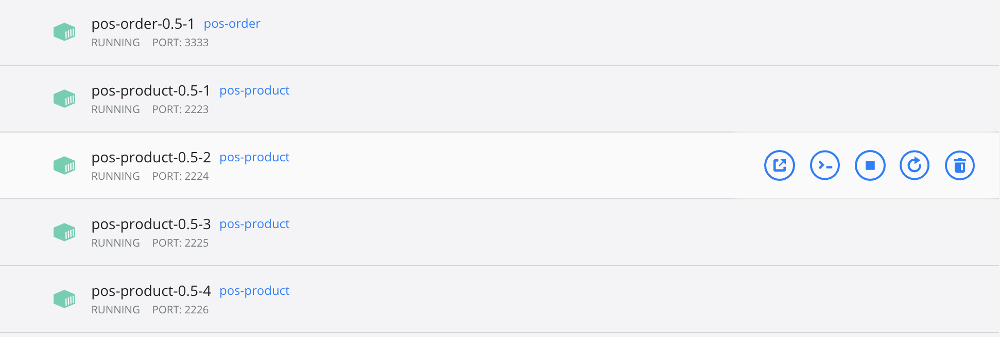
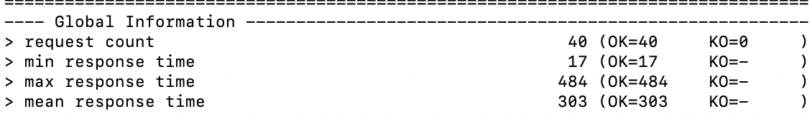
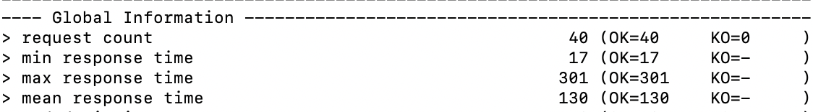

## 系统实现

### 总览

本项目需要实现为微服务架构，包含4个子模块，分别是商品、订单、服务注册与发现、网关。其中，服务注册与发现模块和网管模块属于微服务架构中的基础设施，商品和订单模块则是需自己实现的业务模块。商品和订单服务都要实现为restful风格，使用openapi根据yml文件自动生成restful风格的接口。因此把api的定义抽取为一个子模块，其中定义了商品和订单服务的模型与接口。最终实现为一个maven project下包含5个maven module。

### 商品服务

照搬[aw04](https://github.com/sawork-2024/aw04-SilenceXjh/tree/main)的实现。

### 订单服务

当用户完成付款后，应生成一个订单，并保存在后端。在 client 的 index.js 文件中，已定义了 submitDueOrder 方法，实现了生成订单并在前端页面展示。在后端，我们需要实现将订单信息保存。

首先定义订单类型。前端代码中已经给出了订单的示例，我仿照着在后端yml文件定义了订单类型：

```yml
Order:
  type: object
  properties:
    orderNumber:
      type: integer
    orderItems:
      type: array
      items:
        $ref: "#/components/schemas/Item"
      date:
        type: string
      subTotal:
        type: number
      discount:
        type: number
      total:
        type: number
      paid:
        type: number
      change:
        type: number
      paymentType:
        type: string
```

包含了订单编号、商品条目、下单时间、价格、折扣、付款信息等等。商品条目包含商品名称、购买数量、单价：

```yml
Item:
  type: object
  properties:
    productName:
      type: string
    amount:
      type: integer
    price:
      type: number
```

接着，定义后端接口，实现保存订单和查询订单。这个实现比较简单。

最后，需要在前端 index.js 中的 submitDueOrder 方法中添加调用后端保存订单的接口。

```javascript
let order_items = [];
for(var i = 0; i < cart.length; i++) {
    let order_item = {
        productName: cart[i].product_name,
        amount: cart[i].quantity,
        price: cart[i].price
    };
    order_items.push(order_item);
}
let backend_order = {
    orderNumber: orderNumber,
    orderItems: order_items,
    date: date,
    subTotal: subTotal,
    discount: discount,
    total: orderTotal,
    paid: paid,
    change: change,
    paymentType: type
}
$.ajax({
    url: json_api + 'orders/',
    contentType: "application/json",  // 明确设置请求内容类型为JSON
    dataType: "json",
    data: JSON.stringify(backend_order),
    type: "POST",
    success: function (data) {
        console.log("backend order saved");
    },
    error: function (data) {
        console.log("failed");
    }
})
```

### 服务注册与发现

这是微服务架构中的基础设施。通过 @EnableEurekaServer 注解启动Eureka的服务注册管理。在其他微服务中（如商品和订单服务），添加 @EnableDiscoveryClient 注解表示自己是一个可被发现的服务，并在application.yml中添加eureka服务的地址，这样在本服务启动时就能被注册到eureka中，并被其他服务发现。

```yml
eureka:
  client:
    service-url:
      defaultZone: http://localhost:1111/eureka/
```

### 网关服务

网关服务主要用于请求的过滤和路由转发。在本项目中，商品服务运行在2222端口，订单服务运行在3333端口，而网关服务自身运行在8080端口。有了网关，外界的请求都发送至8080端口，而网关根据请求的路径将请求转发至商品或订单服务的端口，进行实际的处理。同时，在请求的转发过程中，也加上了断路器。

```java
builder.routes()
    .route(p -> p
            .path("/products")
            .filters(f -> f.circuitBreaker(config -> config.setName("products-error")))
            .uri("http://localhost:2222"))
```

## 运行展示

首先启动eureka server服务，然后启动网关、商品和订单服务。在localhost:1111端口上，可以看到3个服务被注册。



打开client中的前端页面，进行2次商品的购买，生成了2个订单。




访问localhost:8080端口下的/orders路径，可以查询到2个订单。



## 水平扩展和压力测试实验

通常来说，用户浏览商品的次数远多于下单次数。因此，在本项目中，将商品服务进行水平向扩展。如下图所示，启动4个product-service实例和1个order-service实例，每个实例使用0.5cpu。



在gatling脚本中，定义30个只访问products接口的并发请求，与5个访问products及orders接口的并发请求。

```java
ChainBuilder products = 
    exec(
        http("Products").get("/products")     
    );

ChainBuilder products_orders =
    exec(
        http("Products").get("/products"),
        http("Orders").get("/orders/")
    );
    
ScenarioBuilder users = scenario("Users").exec(products);
ScenarioBuilder admins = scenario("Admins").exec(products_orders);

{
    setUp(
        users.injectOpen(atOnceUsers(30)),
        admins.injectOpen(atOnceUsers(5))
    ).protocols(httpProtocol);
}
```

当使用2个product-service实例时，响应结果如下：



当使用4个product-service实例时，响应结果如下：



可以看到，通过对商品服务进行水平扩展，整体的响应速度有了明显提升。